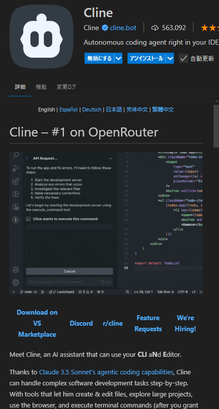
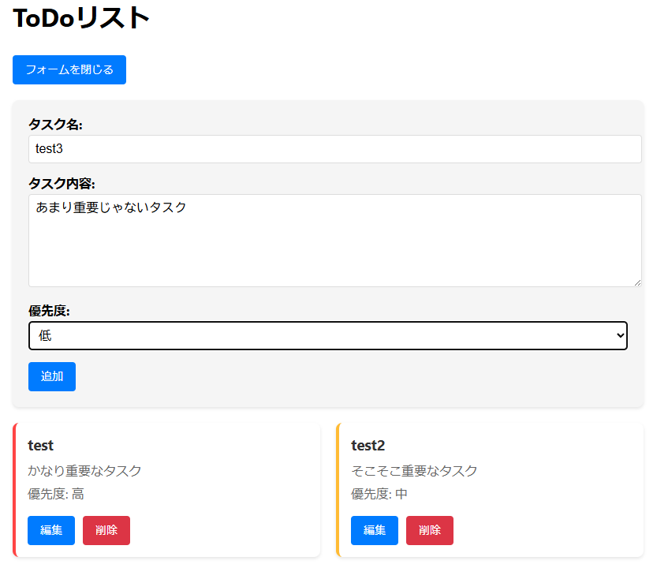
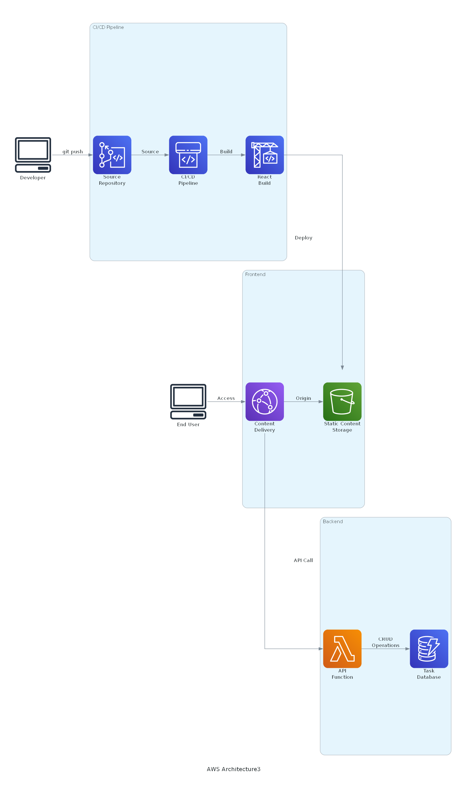
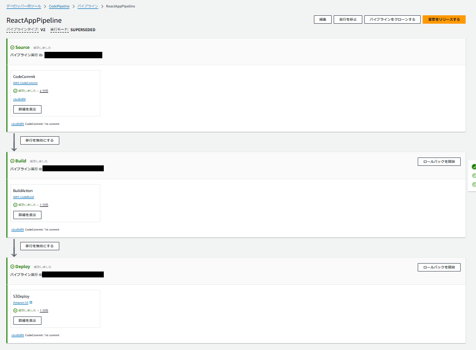
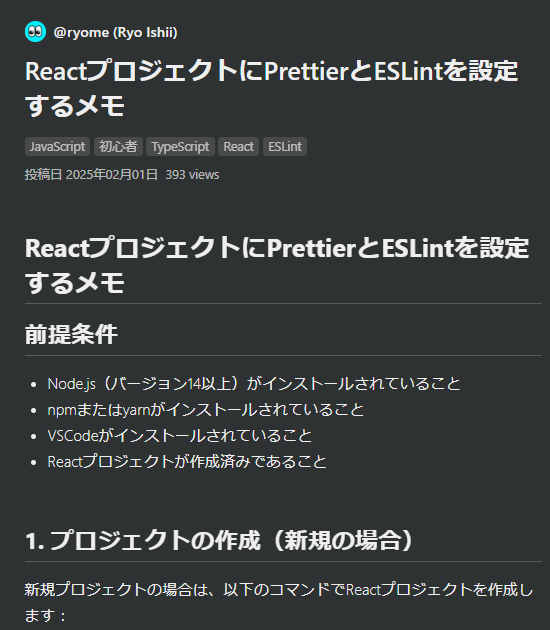

<style>
section {
  background-color: #4774E7;
  color: white;
}

.container {
  position: absolute;
  bottom: 20px;
  left: 20px;
  display: flex;
  align-items: flex-end;
}

.circle-img {
  width: 100px;
  height: 100px;
  border-radius: 50%;
  margin-right: 10px;
}

.left-bottom-container {
  display: flex;
  flex-wrap: wrap;
  margin-left: 10px;
}

.row {
  display: flex;
  align-items: center;
  width: 33%;
  margin-bottom: 10px;
}

.row img {
  width: 50px;
  height: 50px;
  margin-right: 10px;
}

.text {
  margin: 0;
}

/* 追加のスタイル */
h1 {
  font-size: 2.5em;
  color: #333;
}

h2 {
  font-size: 2em;
  color: #333;
}

section {
  font-size: 1.8em;
}

.normal-slide {
  background-color: white;
  color: #333;
  padding: 40px;
}

.normal-slide h1,
.normal-slide h2 {
  color: #4774E7;
}

.toc {
  padding: 20px;
  font-size: 1.5em;
}

.normal-slide pre {
  background-color: #f5f5f5;
  padding: 30px;
  border-radius: 8px;
  margin: 20px 0;
  font-size: 1.6em;
  line-height: 1.4;
}

.normal-slide code {
  font-size: 1.6em;
}

ul {
  list-style-type: disc;
  padding-left: 40px;
  line-height: 1.6;
}

li {
  margin: 15px 0;
}
</style>

# ClineでAWS CDKやインフラ構成図作ってみた

<div class="container">
  
  <div class="left-bottom-container">
    <div class="row">
      
      <p class="text">@ryomeblog</p>
    </div>
    <div class="row">
      
      <p class="text">@ryome</p>
    </div>
    <div class="row">
      
      <p class="text">@ryome</p>
    </div>
    <div class="row">
      
      <p class="text">@ryomeblog</p>
    </div>
    <div class="row">
      
      <p class="text">@ryome</p>
    </div>
  </div>
</div>

---

<!-- 目次 -->
<div class="normal-slide">

# 目次

1. **Clineとは？**
2. **Clineでインフラ構成図の生成**
3. **AWS CDKコード生成**
4. **Clineをこんな使い方が便利！！**

</div>

---

<!-- Clineとは？ -->
<div class="normal-slide">

# Clineとは？



- VSCode拡張機能として動作するAIエージェント
- オープンソースで無料
- 複数のAIモデルとAPIに対応

</div>

---

<div class="normal-slide">

# AIエージェントとは？

- AIエージェントとは、特定の目的を達成するために、自律的に環境を認識し、
  意思決定を行うAIシステム
- 設定された目標を達成するために、自律的な判断と行動ができる
- 目標達成の過程でエラーが発生しても自己修正してくれる

</div>

---

<div class="normal-slide">

# 対応AIモデル

- OpenRouter / Anthropic
- Google Gemini
- OpenAI / AWS Bedrock
- GitHub Copilot
- Llama / Ollama

</div>

---

<div class="normal-slide">

# Cline導入方法

- VSCodeの拡張機能で「clien」と検索
- Clineをインストール
- OpenAI等のAIモデルのAPI KEYを取得する
- clineにAPI KEYを入力する
- 完了！！

**※ AIモデルによっては学習に使われる可能性があるので、
Clineを商用利用する際は注意してください。**

</div>

---

<div class="normal-slide">

# Clineって何ができるの？：Architect

- アーキテクチャ設計
  - こういうの作りたいんだけどっていうざっくりとしたイメージを形にしてくれる
- インフラ構成図作成
  - AWSとかGCPとか言っても通じる
  - サービス名伝えるだけで構成考えてくれる
  - インフラ構成図はPythonライブラリのDiagramsを使用する可能！

</div>

---

<div class="normal-slide">

# Clineって何ができるの？：Architect

- リアルタイム音声翻訳アプリ作りたい～
- ステレオミキサーの音声を翻訳して機械音声で再生して～
- こちらのマイクで話した音声を翻訳して機械音声でマイクで再生して～
- これができる → [リアルタイム音声翻訳システム アーキテクチャ設計](https://github.com/ryomeblog/real-translation/blob/main/doc/architecture.md)

</div>

---

<div class="normal-slide">

# Clineって何ができるの？：Code

- コード生成と修正
  - タスクを伝えるとコードを実装してくれる
  - ターミナルとかいじって勝手に依存関係解決してくれる
  - こちらは承認を押しているだけ
  - このスライドを作ったのもCline！！
- エラー自動修正
  - エラーが出ても勝手に分析して修正してくれる

</div>

---

<div class="normal-slide">

# Clineって何ができるの？：Code

```text:プロンプト
あなたはこれから簡単なToDoリストサンプルアプリを作成してください。
このアプリはタスクを一覧で見ることができ、タスクを追加と編集、削除ができます。
タスク作成時に入力する項目はタスク名、タスク内容、タスクの優先度です。
```

- これができる → [ToDoリストアプリ](https://github.com/ryomeblog/cline-cdk-sample/blob/master/todolist/%E3%83%81%E3%83%A3%E3%83%83%E3%83%88%E5%86%85%E5%AE%B9.md)

</div>

---

<div class="normal-slide">

# Clineって何ができるの？：Code



---

<div class="normal-slide">

# Clineって何ができるの？：Ask

- プロジェクト関連の質問対応
  - どこに何のファイルがある？
  - 実行コマンドはどうすれば良いの？
  - 環境変数は何がいる？
  - なんでこの仕様にしたか？とか文面で残していれば教えてくれる
- コードの説明
  - ～ファイルの～関数は何してるの？

</div>

---

<div class="normal-slide">

# ClineにDiagramsを使用してインフラ構成図を書いてもらった！



リポジトリはこちら → [cline-cdk-sample](https://github.com/ryomeblog/cline-cdk-sample/tree/master)

</div>

---

<div class="normal-slide">

# Diagramsとは？

- Pythonコードを使用してインフラストラクチャの構成図を描画するためのツール
- AWS、GCP、Azureなどの多様なクラウドプロバイダーをサポート
- コード管理できるのでバージョン管理が容易

</div>

---

<div class="normal-slide">

# diagramsのセットアップ

```bash
python -m venv venv # 仮想環境の作成

.\venv\Scripts\activate # 環境の有効化

pip install diagrams # インストール
```

</div>

---

<div class="normal-slide">

# diagramsの基本的な使い方

- diagramsと使用したいサービスなどをインポート

```python
from diagrams import Diagram
from diagrams.aws.storage import S3
from diagrams.aws.network import CloudFront
```

</div>

---

<div class="normal-slide">

# diagramsの基本的な使い方

- Diagramの中で使用したいサービス名を定義してサービス間の関係性を「>>」で定義する

```python
with Diagram("AWS Architecture1", show=False):
    cf = CloudFront("CloudFront\nDistribution")
    s3 = S3("React\nBuild Files")

    cf >> s3
```

</div>

---

<div class="normal-slide">

# 今回Clineで試した構成

- 初回構築：S3 + CloudFront
- 2回目構築：CodePipeline + CodeBuild + CodeCommit 追加
- 3回目構築：Lambda + DynamoDB 追加

</div>

---

<div class="normal-slide">

# AWS CDKとは？

- AWSのインフラストラクチャをコードとして定義し、プロビジョニングするためのオープンソースのソフトウェア開発フレームワーク
- インフラストラクチャのデプロイと管理が目的
- 複数の言語でコーディング可能
  - TypeScript、JavaScript、Python、Java、C#、Go
- CloudFormationへ変換してデプロイしている

</div>

---

<div class="normal-slide">

# CDKプロジェクト作成

```bash
# インストール
npm install -g aws-cdk

# プロジェクト作成
cdk init app --language 【言語】
```

</div>

---

<div class="normal-slide">

# サンプルコード

GitHubリポジトリ：[aws-cdk-examples](https://github.com/ryomeblog/aws-cdk-examples)

</div>

---

<div class="normal-slide">

# デプロイまでの手順1

- 以下のコマンドを実行する

```
git clone https://github.com/ryomeblog/cline-cdk-sample.git
cd cline-cdk-sample/cline-cdk-sample3
npm install
cdk deploy
```

</div>

---

<div class="normal-slide">

# デプロイまでの手順2

- CodeCommitのクローンURLをコピー
- `git clone 【URL】` コマンド実施（IAMユーザのCodeCommitのHTTPS Git 認証情報が必要）
- `cd react-app-repository` でディレクトリを移動
- todolistディレクトリ配下をコピー

```
cp -r ../todolist .
```

</div>

---

<div class="normal-slide">

# デプロイまでの手順3

- ブランチを作成してプッシュする

```
git branch main
git checkout main
git push -u origin main
```

</div>

---

<div class="normal-slide">

# デプロイまでの手順4

- パイプラインがデプロイしているところまでマネージメントコンソールで確認する



</div>

---

<div class="normal-slide">

# デプロイまでの手順5

- CloudFrontのディストリビューションドメイン名にアクセスして画面が見れたら成功


</div>

---

<div class="normal-slide">

# 便利な使い方①

## ESLint/Prettier等の設定
- 何かの手順を記事にまとめておいて、リンクかテキストを渡して指示するだけ
- 環境構築時も必要なものは勝手にインストールして動くところまで完了させてくれる



</div>

---

<div class="normal-slide">

# 便利な使い方②：テストコード生成

- JestやPlaywrightテストコード生成に便利！！
- たたき台程度ならすぐに作ってくれる
- 一緒にパイプラインも直して自動テストを組み込んでくれる
- **テスト項目と観点を言語化**していれば自動生成可能！

</div>

---

<div class="normal-slide">

# 便利な使い方③：ドキュメント生成

- ブログ記事のアイデアが浮かんで、やりたいこと話したら**コードも記事もできている**
- テストケースの洗い出しとかライセンスチェックとかClineに頼んでフォーマットしてもらえる
- プロジェクトの内容を加味したREADME.meファイルを作ってくれる

</div>

---

<div class="normal-slide">

# 便利な使い方④：ルールファイル

- `.clinerules` を活用することでコーディング規約やプロジェクトのルール（コミットルールなど）に従った開発を行ってくれる

```plaintext
## ロール定義
あなたは Marpを使用したスライド作成のスペシャリストとして対応してください。

## 技術スタック
- Markdown
- Marp
...etc
```

</div>
